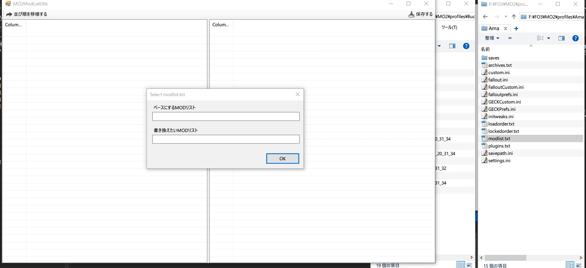

# MO2ModListUtls

## Overview

MO2左ペインの並び順を移植するツールです

## Notice
- アイコンは [ICOOON MONO](https://icooon-mono.com
) 様のものを使用しています  
再配布は禁止事項に当たるためリポジトリで管理していません  
ビルドする場合は上記サイトから取得するか代替のアイコンをご用意ください

## Licence

[MIT](https://github.com/hananoki/MO2ModListUtls/blob/master/LICENSE.md)